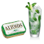

# AltoidMojito



An Altoid Mojito discord bot.

## Getting Started

### Prerequisites

1. Clone the repository.
1. Run `npm install`.
1. Configure the bot by creating a .env file with the appropriate environment variables.
1. Start the bot with `npm start`, or debug using VSCode.

On startup, the bot will log a URL to add AltoidMojito to a discord server.

## Environment Variables

Create a .env file at the root of the project and add the following environment variables:

```sh
ALTOIDMOJITO_CLIENT_ID='<discord bot client id>'
ALTOIDMOJITO_TOKEN='<discord bot token>'
```

### How To Get Values For Environment Variables

- **ALTOIDMOJITO_CLIENT_ID**: Discord Application Client ID. This can be found on the "General Information" page for the relevant [discord application](https://discord.com/developers/applications).
- **ALTOIDMOJITO_TOKEN**: Discord bot token. This can be found on the Application's Bot page.
